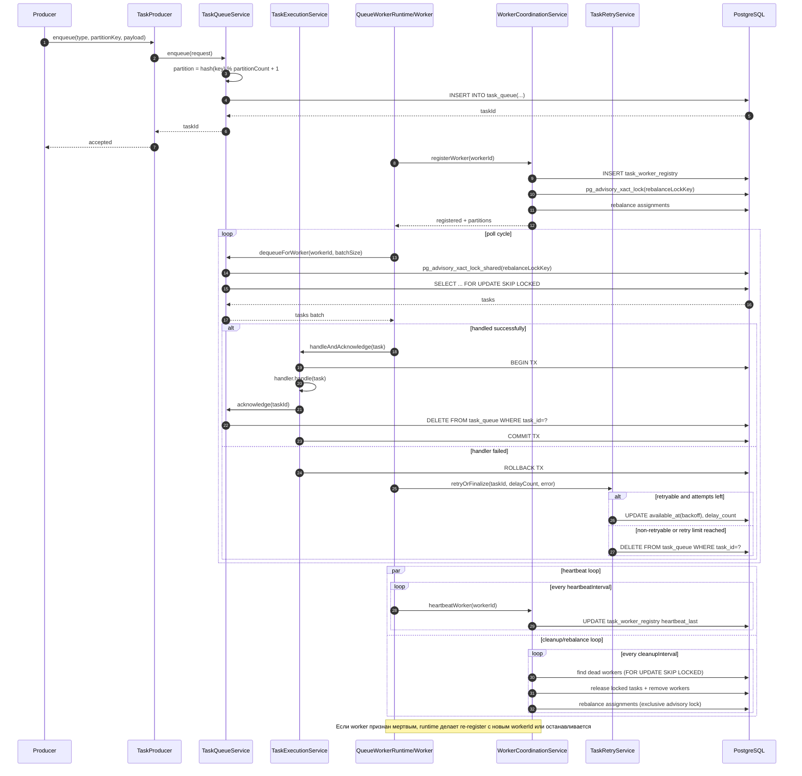
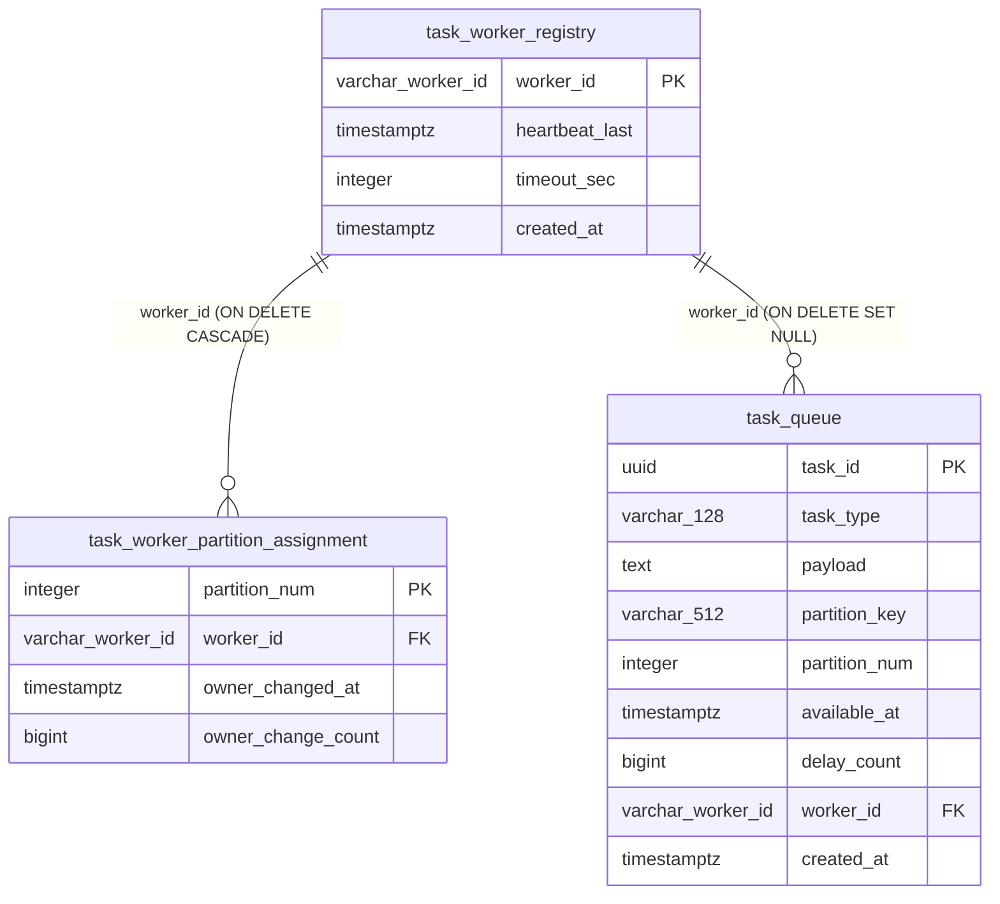

# Task Queue: Архитектура

## Назначение

Библиотека реализует распределенную обработку задач в PostgreSQL-очереди с семантикой:

- последовательная обработка задач с одинаковым `partition_key`;
- горизонтальное масштабирование по воркерам;
- heartbeat/детект «мертвых» воркеров;
- ребаланс закрепления партиций между живыми воркерами;
- retry/backoff с классификацией retryable/non-retryable исключений.

## Модульная структура

- `task-queue-core`
    - доменные модели (`QueuedTask`, `TaskEnqueueRequest`);
    - алгоритмы (`TaskPartitioner`, `PartitionAssignmentPlanner`);
    - retry-политика и классификатор ошибок;
    - конфигурация `TaskQueueProperties`.
- `task-queue-jdbc`
    - JDBC-репозитории и SQL-операции;
    - сервисы с транзакциями;
    - runtime-движок воркеров (`QueueWorkerRuntime`);
    - метрики Micrometer.
- `task-queue-spring-boot-starter`
    - автоконфигурация и wiring всех бинов библиотеки.

## Поток обработки

### Постановка задачи (Producer)

1. Продюсер вызывает `TaskProducer.enqueue(...)` (по умолчанию реализован `TaskProducerService`).
2. `TaskQueueService.enqueue(...)`:
    - валидирует вход;
    - вычисляет `partition_num = hash(partition_key) % partition_count + 1`;
    - пишет запись в `task_queue`.

### Запуск runtime

При старте приложения `QueueWorkerRuntime`:

1. запускает `workerCount` worker-потоков;
2. каждый worker регистрируется в `task_worker_registry`;
3. при регистрации вызывается ребаланс партиций;
4. для каждого worker запускается heartbeat-монитор;
5. отдельный cleanup-цикл периодически удаляет «мертвые» воркеры и триггерит ребаланс.

`task.queue.runtime-enabled=false` отключает runtime (producer-only режим).

### Выборка и обработка

1. Worker вызывает `TaskQueueService.dequeueForWorker(workerId, batchSize)`.
2. Выборка идет только из партиций, закрепленных за worker.
3. SQL использует `FOR UPDATE SKIP LOCKED` для конкурентной выборки без конфликтов.
4. Режим обработки выбирается свойством `task.queue.handling-transaction-mode`:
    - `TRANSACTIONAL`: Worker вызывает `TaskExecutionService.handleAndAcknowledge(task)`, где
      `handler.handle(task)` и `acknowledge(taskId)` идут в одной транзакции;
    - `NON_TRANSACTIONAL`: Worker выполняет `handler.handle(task)` вне общей транзакции, затем
      вызывает `acknowledge(taskId)` отдельной транзакцией.
5. После отката при ошибке вызывается `TaskRetryService.retryOrFinalize(...)`:
    - non-retryable: удалить задачу;
    - retryable: либо `delay(...)`, либо удалить при исчерпании попыток.

## Диаграмма последовательности

## Ребаланс и блокировки

Ребаланс выполняется в `WorkerCoordinationService.rebalanceInternal()`:

1. берется `pg_advisory_xact_lock(rebalanceLockKey)`;
2. очищаются assignments вне диапазона `partitionCount`;
3. строится новый план `partition -> worker` с минимальным переносом текущих партиций;
4. применяются только необходимые изменения.

Для стабильной совместной работы выборки и ребаланса:

- `dequeueForWorker(...)` берет `pg_advisory_xact_lock_shared(rebalanceLockKey)`;
- ребаланс берет эксклюзивный lock по тому же ключу.

## Retry-классификация

Порядок принятия решения в `RetryExceptionClassifier`:

1. Если исключение (или его cause, если включено) попало в `not-retryable-exceptions` -> retry
   запрещен.
2. Иначе, если попало в `retryable-exceptions` -> retry разрешен.
3. Иначе используется `retry-default-retryable`.

## Схема хранения

Используются таблицы:

- `task_worker_registry` — реестр воркеров и heartbeat;
- `task_worker_partition_assignment` — закрепление партиций за воркерами;
- `task_queue` — очередь задач.

`task_queue.partition_num` — логическая ссылка на партицию, но явный FK на
`task_worker_partition_assignment.partition_num` в схеме не задан.

DDL лежит в Liquibase changeset:

- `task-queue-jdbc/src/main/resources/db/changelog/db.changelog-master.yaml`
- `task-queue-jdbc/src/main/resources/db/changelog/changes/001-task-queue-init.sql`

Для таблиц `task_queue`, `task_worker_registry` и `task_worker_partition_assignment`
заданы более агрессивные per-table параметры autovacuum/analyze, так как это
high-churn таблицы (частые `insert`/`update`/`delete`).

## Жизненный цикл данных в таблицах

| Таблица                            | Ключевой момент                                         | Где происходит                                                                                                       | Какие поля меняются                                                                                                                                |
|------------------------------------|---------------------------------------------------------|----------------------------------------------------------------------------------------------------------------------|----------------------------------------------------------------------------------------------------------------------------------------------------|
| `task_worker_registry`             | Регистрация воркера                                     | `WorkerCoordinationService.registerWorker()` -> `WorkerRegistryRepository.registerWorker()`                          | `insert`: `worker_id`, `heartbeat_last=now`, `timeout_sec`, `created_at=now`                                                                       |
| `task_worker_registry`             | Heartbeat                                               | `WorkerCoordinationService.heartbeatWorker()` -> `WorkerRegistryRepository.heartbeatWorker()`                        | `update`: `heartbeat_last=now`                                                                                                                     |
| `task_worker_registry`             | Разрегистрация воркера (штатная)                        | `WorkerCoordinationService.unregisterWorker()` -> `WorkerRegistryRepository.removeWorker()`                          | `delete` строки воркера                                                                                                                            |
| `task_worker_registry`             | Cleanup мертвых воркеров                                | `WorkerCoordinationService.cleanUpDeadWorkers()` -> `WorkerRegistryRepository.removeWorker()`                        | `delete` строк dead worker                                                                                                                         |
| `task_worker_partition_assignment` | Первичное назначение партиции воркеру                   | `WorkerCoordinationService.rebalanceInternal()` -> `WorkerRegistryRepository.upsertPartitionAssignment()`            | `insert`: `partition_num`, `worker_id`, `owner_changed_at=now`, `owner_change_count=1`                                                             |
| `task_worker_partition_assignment` | Переназначение партиции другому воркеру                 | `WorkerCoordinationService.rebalanceInternal()` -> `WorkerRegistryRepository.upsertPartitionAssignment()`            | `update` (только при смене владельца): `worker_id`, `owner_changed_at=now`, `owner_change_count = owner_change_count + 1`                          |
| `task_worker_partition_assignment` | Очистка партиций вне диапазона                          | `WorkerCoordinationService.rebalanceInternal()` -> `WorkerRegistryRepository.removeAssignmentsAbovePartition()`      | `delete` строк с `partition_num > partition_count`                                                                                                 |
| `task_worker_partition_assignment` | Нет живых воркеров                                      | `WorkerCoordinationService.rebalanceInternal()` -> `WorkerRegistryRepository.clearAssignments()`                     | `delete` всех строк                                                                                                                                |
| `task_worker_partition_assignment` | Удаление воркера из реестра                             | FK `worker_id -> task_worker_registry.worker_id` (`ON DELETE CASCADE`)                                               | Автоматический `delete` дочерних assignments этого воркера                                                                                         |
| `task_queue`                       | Постановка задачи                                       | `TaskQueueService.enqueue()` -> `TaskQueueRepository.enqueue()`                                                      | `insert`: `task_id`, `task_type`, `payload`, `partition_key`, `partition_num`, `available_at`, `delay_count=0`, `worker_id=null`, `created_at=now` |
| `task_queue`                       | Захват задач воркером на обработку                      | `TaskQueueService.dequeueForWorker()` -> `TaskQueueRepository.lockNextTasksForWorker()`                              | `update`: `worker_id = :workerId` для выбранных задач                                                                                              |
| `task_queue`                       | Успешное завершение задачи (ack)                        | `TaskExecutionService.handleAndAcknowledge()` или `TaskQueueService.acknowledge()`                                   | `delete` строки задачи                                                                                                                             |
| `task_queue`                       | Retry после ошибки                                      | `TaskRetryService.retryOrFinalize()` -> `TaskQueueRepository.delay()`                                                | `update`: `available_at = now + backoff`, `delay_count = delay_count + 1`, `worker_id = null`                                                      |
| `task_queue`                       | Финализация без retry (non-retryable или лимит попыток) | `TaskRetryService.retryOrFinalize()` -> `TaskQueueRepository.remove()`                                               | `delete` строки задачи                                                                                                                             |
| `task_queue`                       | Освобождение захваченных задач при удалении воркера     | `WorkerCoordinationService.unregisterWorker()/cleanUpDeadWorkers()` -> `TaskQueueRepository.releaseLockedByWorker()` | `update`: `worker_id = null` для задач удаляемого воркера                                                                                          |
| `task_queue`                       | Удаление воркера из реестра                             | FK `worker_id -> task_worker_registry.worker_id` (`ON DELETE SET NULL`)                                              | Автоматический `update`: `worker_id = null` в связанных задачах                                                                                    |

## Метрики

Основные метрики Micrometer (`task.queue.process.*`):

- `register.success`, `register.failure`
- `heartbeat.success`, `heartbeat.failure`, `heartbeat.timeout`, `heartbeat.not_found`,
  `heartbeat.latency`
- `cleanup.runs`, `cleanup.removed`
- `rebalance.runs`, `rebalance.failures`, `rebalance.latency`

В Prometheus они экспонируются через стандартное преобразование в snake_case с суффиксами `_total`,
`_seconds` и т.д.
