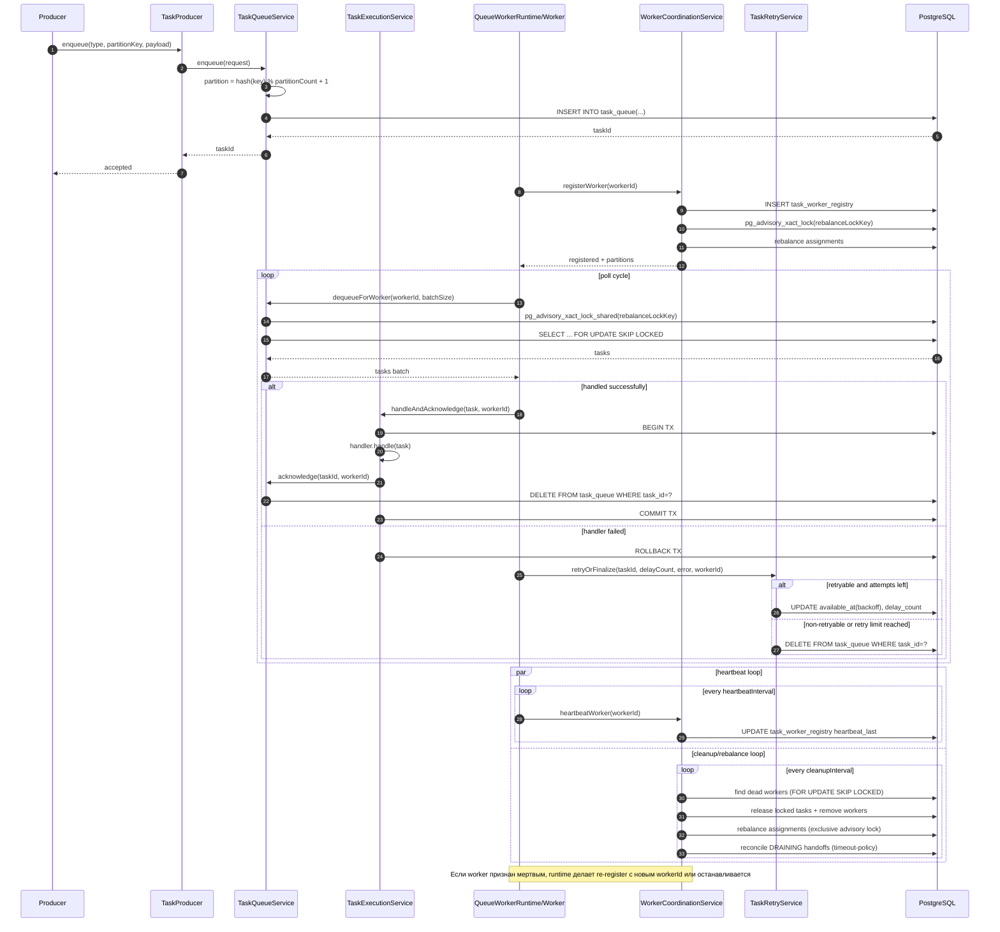
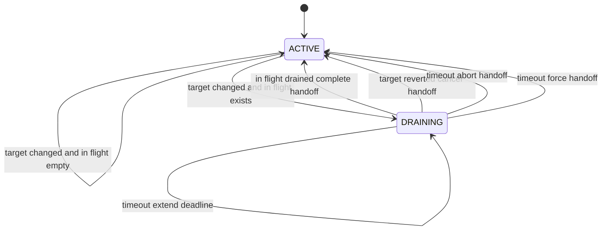
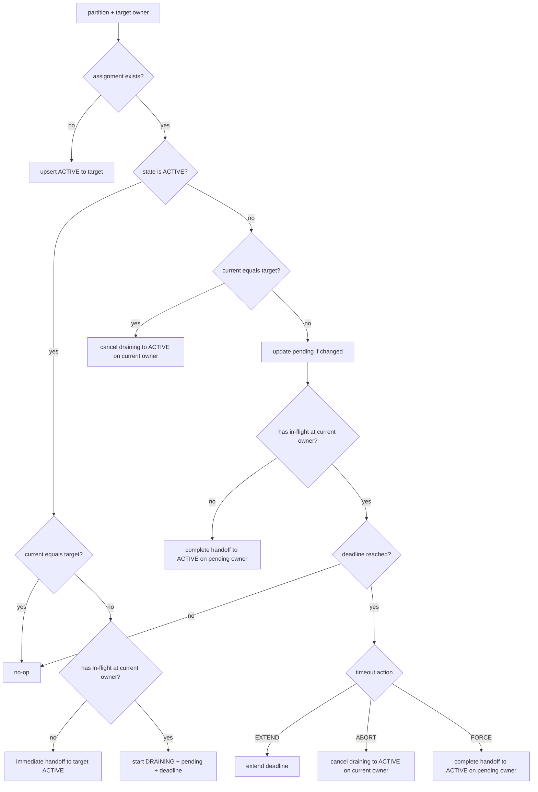
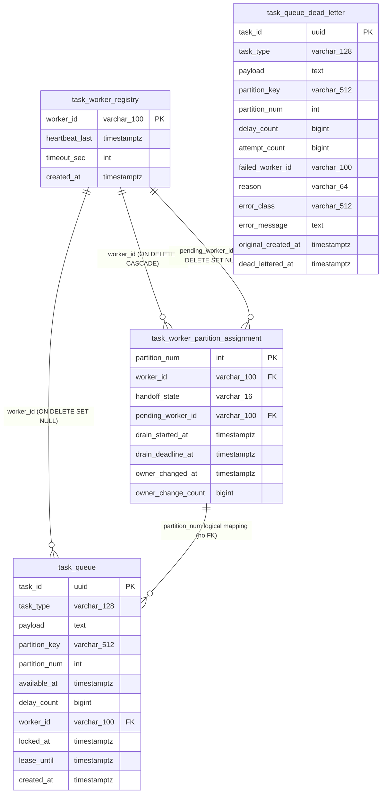

# Task Queue: Архитектура

## Назначение

Библиотека реализует распределенную обработку задач в PostgreSQL-очереди с семантикой:

- последовательная обработка доступных задач с одинаковым `partition_key` в штатном сценарии;
- горизонтальное масштабирование по воркерам;
- heartbeat/детект «мертвых» воркеров;
- ребаланс закрепления партиций между живыми воркерами;
- retry/backoff с классификацией retryable/non-retryable исключений.

## Модульная структура

- `task-queue-core`
    - доменные модели (`QueuedTask`, `TaskEnqueueRequest`);
    - алгоритмы (`TaskPartitioner`, `PartitionAssignmentPlanner`);
    - retry-политика и классификатор ошибок;
    - конфигурация `TaskQueueProperties`.
- `task-queue-jdbc`
    - JDBC-репозитории и SQL-операции;
    - сервисы с транзакциями;
    - runtime-движок воркеров (`QueueWorkerRuntime`);
    - метрики Micrometer.
- `task-queue-spring-boot-starter`
    - автоконфигурация и wiring всех бинов библиотеки.

## Поток обработки

### Постановка задачи (Producer)

1. Продюсер вызывает `TaskProducer.enqueue(...)` (по умолчанию реализован `TaskProducerService`).
2. `TaskQueueService.enqueue(...)`:
    - валидирует вход;
    - вычисляет `partition_num = hash(partition_key) % partition_count + 1`;
    - пишет запись в `task_queue`.

Все внутренние timestamp-поля очереди (`created_at`, `available_at`, heartbeat, lease, handoff,
retention) считаются от времени PostgreSQL. Для отложенной постановки относительно текущего момента
используйте `TaskProducer.enqueueDelayed(..., Duration delay)`, чтобы не зависеть от clock skew между
JVM и БД.

### Запуск runtime

При старте приложения `QueueWorkerRuntime`:

1. запускает `workerCount` worker-потоков;
2. каждый worker регистрируется в `task_worker_registry`;
3. при регистрации вызывается ребаланс партиций;
4. для каждого worker запускается heartbeat-монитор;
5. отдельный cleanup-цикл периодически освобождает задачи с истекшим lease, удаляет «мертвые»
   воркеры и триггерит ребаланс;
6. в том же фоне периодически выполняется reconcile handoff-состояний (`DRAINING`), чтобы
   завершать/откатывать зависшие переназначения партиций по timeout-policy.

`task.queue.runtime-enabled=false` отключает runtime (producer-only режим).

### Выборка и обработка

1. Worker вызывает `TaskQueueService.dequeueForWorker(workerId, batchSize)`.
2. Выборка идет только из партиций, закрепленных за worker в состоянии `ACTIVE`.
   Партиции в состоянии `DRAINING` не отдают новые задачи старому владельцу.
3. SQL использует `FOR UPDATE SKIP LOCKED` для конкурентной выборки без конфликтов и выставляет
   `locked_at`/`lease_until` для защиты от зависших in-flight задач.
4. Режим обработки выбирается свойством `task.queue.handling-transaction-mode`:
    - `TRANSACTIONAL`: Worker вызывает `TaskExecutionService.handleAndAcknowledge(task, workerId)`,
      где `handler.handle(task)` и owner-checked `acknowledge(taskId, workerId)` идут в одной
      транзакции;
    - `NON_TRANSACTIONAL`: Worker выполняет `handler.handle(task)` вне общей транзакции, затем
      вызывает owner-checked `acknowledge(taskId, workerId)` отдельной транзакцией.
5. После отката при ошибке вызывается `TaskRetryService.retryOrFinalize(...)`:
    - non-retryable: удалить задачу;
    - retryable: либо `delay(...)`, либо удалить при исчерпании попыток;
    - если `task.queue.dead-letter-enabled=true`, финализированная задача перед удалением
      копируется в `task_queue_dead_letter`.

### Lease и падение JVM

При захвате задачи worker получает lease на `task.queue.task-lease-timeout`. Пока обработчик
работает, runtime периодически продлевает `lease_until`. Если JVM падает, задачи остаются
закрепленными за старым `worker_id` до cleanup: «мертвый» worker удаляется после heartbeat timeout,
а его задачи освобождаются. Если JVM жива, но обработчик завис и не продлевает lease, отдельный
cleanup освобождает задачу после истечения `lease_until`; stale worker после этого не сможет удалить
задачу из-за owner-check.

Эта модель сохраняет `at-least-once` семантику: после crash/timeout задача может быть выполнена
повторно, поэтому обработчики должны быть идемпотентными или использовать бизнес-idempotency key.
`task.queue.task-lease-timeout` должен быть достаточно большим, чтобы выдерживать кратковременные
паузы GC/БД между продлениями lease.

При фатальных runtime-ошибках библиотека вызывает `TaskQueueRuntimeShutdownStrategy`. Дефолтная
стратегия starter'а делает graceful `SpringApplication.exit(...)` в отдельном потоке, а не
мгновенный `Runtime.halt(...)`. Приложение может объявить собственный bean
`TaskQueueRuntimeShutdownStrategy`, если нужно отправить сигнал orchestrator'у, закрыть только часть
инфраструктуры или переопределить поведение в тестах.

### Гарантия порядка и retry

Очередь сохраняет последовательность для доступных задач внутри одной логической партиции, но при
ошибках возможен reordering. Если первая задача с `partition_key=K` упала и перенесена на retry с
будущим `available_at`, следующая задача с тем же ключом может стать доступной и быть обработана
раньше повторной попытки первой задачи.

Это осознанный trade-off текущей модели: retry не блокирует весь ключ или партицию. Если конкретному
обработчику нужна строгая FIFO-семантика даже через retry, он должен быть идемпотентным и/или
самостоятельно проверять бизнес-версию/состояние. Альтернативный режим со строгим
head-of-line blocking можно добавить отдельно, но он снизит throughput для ключей с проблемными
задачами.

### Выбор количества партиций

`task.queue.partition-count` нужно выбирать с запасом относительно ожидаемого максимального числа
worker-потоков во всем кластере. Не страшно, если партиций больше, чем потоков: один worker может
владеть и обрабатывать несколько партиций. Запас по партициям позволяет позже добавлять worker'ы без
изменения `partition-count`.

Изменять `partition-count` в уже работающей очереди нельзя без отдельной миграционной процедуры:
`partition_num` вычисляется как `hash(partition_key) % partition_count + 1`, поэтому новые задачи
того же ключа могут начать попадать в другую партицию, пока старые еще остаются в прежней.

## Диаграмма последовательности

## Ребаланс и блокировки

Ребаланс выполняется в `WorkerCoordinationService.rebalanceInternal()` и включает
не только расчет целевого владельца партиции, но и state-machine handoff.

### Блокировки

Для согласованности выборки и ребаланса используется один и тот же advisory lock:

- `TaskQueueService.dequeueForWorker(...)` берет `pg_advisory_xact_lock_shared(rebalanceLockKey)`;
- `WorkerCoordinationService.rebalanceInternal()` берет `pg_advisory_xact_lock(rebalanceLockKey)`.

Это исключает гонку, когда assignment уже поменялся, а выборка задач еще работает по старому
снимку.

### Модель состояния assignment

Для каждой партиции в `task_worker_partition_assignment` есть состояние handoff:

- `ACTIVE` — обычное рабочее состояние; owner может забирать новые задачи партиции.
- `DRAINING` — инициирован перенос ownership; старому owner больше не отдаются новые задачи,
  но ему дается время завершить in-flight задачи.

Переходы:

### Алгоритм применения плана

1. Берется `pg_advisory_xact_lock(rebalanceLockKey)`.
2. Удаляются assignments с `partition_num > partitionCount`.
3. Загружаются live workers и текущие assignments.
4. Planner считает целевой `partition -> targetWorker`.
5. Для каждой партиции выполняется переход state-machine:
    - если assignment отсутствует: создается `ACTIVE` с `worker_id = targetWorker`;
    - если state=`ACTIVE`:
        - `currentWorker == targetWorker` -> ничего не меняется;
        - `currentWorker != targetWorker` и нет in-flight -> immediate handoff (`ACTIVE` на новом
          owner);
        - `currentWorker != targetWorker` и есть in-flight -> `DRAINING` +
          `pending_worker_id=targetWorker`
            + `drain_started_at` + `drain_deadline_at`;
    - если state=`DRAINING`:
        - если target снова совпал с текущим owner -> cancel (`ACTIVE`, pending очищается);
        - если target изменился -> обновляется `pending_worker_id`;
        - если in-flight завершены -> complete handoff (owner = pending, state=`ACTIVE`);
        - если наступил timeout:
            - `EXTEND` -> продлевается `drain_deadline_at`;
            - `ABORT` -> возврат в `ACTIVE` на старом owner;
            - `FORCE` -> принудительный complete handoff на pending owner.

Граф принятия решения по одной партиции:

### Почему сохраняется упорядоченность по partition key

- Во время `DRAINING` старому owner не выдаются новые задачи партиции.
- Переход ownership в нового owner происходит после подтвержденного отсутствия in-flight задач
  у старого owner (или по явной timeout-policy `FORCE`).
- При `EXTEND/ABORT` можно полностью избежать пересечения старого и нового owner по одной партиции.

### Reconcile цикл

Даже если состав воркеров не меняется, `QueueWorkerRuntime` периодически вызывает
`WorkerCoordinationService.reconcileHandoffs()`:

- повторно запускается тот же `rebalanceInternal()`;
- застрявшие `DRAINING` assignments проверяются на завершение/timeout;
- timeout-policy применяется без ожидания нового события регистрации/cleanup.

## Retry-классификация

Порядок принятия решения в `RetryExceptionClassifier`:

1. Если исключение (или его cause, если включено) попало в `not-retryable-exceptions` -> retry
   запрещен.
2. Иначе, если попало в `retryable-exceptions` -> retry разрешен.
3. Иначе используется `retry-default-retryable`.

## Схема хранения

Используются таблицы:

- `task_worker_registry` — реестр воркеров и heartbeat;
- `task_worker_partition_assignment` — закрепление партиций за воркерами и состояние handoff;
- `task_queue` — очередь задач.

В ER-диаграмме связь `task_worker_partition_assignment -> task_queue` по `partition_num`
помечена как логическая: явный FK на
`task_worker_partition_assignment.partition_num` в схеме не задан.

DDL лежит в Liquibase changeset:

- `task-queue-jdbc/src/main/resources/db/changelog/db.changelog-master.yaml`
- `task-queue-jdbc/src/main/resources/db/changelog/changes/001-task-queue-init.sql`
- `task-queue-jdbc/src/main/resources/db/changelog/changes/005-partition-handoff-state.sql`
- `task-queue-jdbc/src/main/resources/db/changelog/changes/007-task-queue-task-lease.sql`

Для таблиц `task_queue`, `task_worker_registry` и `task_worker_partition_assignment`
заданы более агрессивные per-table параметры autovacuum/analyze, так как это
high-churn таблицы (частые `insert`/`update`/`delete`).

## Жизненный цикл данных в таблицах

| Таблица                            | Ключевой момент                                         | Где происходит                                                                                                       | Какие поля меняются                                                                                                                                                                           |
|------------------------------------|---------------------------------------------------------|----------------------------------------------------------------------------------------------------------------------|-----------------------------------------------------------------------------------------------------------------------------------------------------------------------------------------------|
| `task_worker_registry`             | Регистрация воркера                                     | `WorkerCoordinationService.registerWorker()` -> `WorkerRegistryRepository.registerWorker()`                          | `insert`: `worker_id`, `heartbeat_last=now`, `timeout_sec`, `created_at=now`                                                                                                                  |
| `task_worker_registry`             | Heartbeat                                               | `WorkerCoordinationService.heartbeatWorker()` -> `WorkerRegistryRepository.heartbeatWorker()`                        | `update`: `heartbeat_last=now`                                                                                                                                                                |
| `task_worker_registry`             | Разрегистрация воркера (штатная)                        | `WorkerCoordinationService.unregisterWorker()` -> `WorkerRegistryRepository.removeWorker()`                          | `delete` строки воркера                                                                                                                                                                       |
| `task_worker_registry`             | Cleanup мертвых воркеров                                | `WorkerCoordinationService.cleanUpDeadWorkers()` -> `WorkerRegistryRepository.removeWorker()`                        | `delete` строк dead worker                                                                                                                                                                    |
| `task_worker_partition_assignment` | Первичное назначение партиции воркеру                   | `WorkerCoordinationService.rebalanceInternal()` -> `WorkerRegistryRepository.upsertActiveAssignment()`               | `insert`: `partition_num`, `worker_id`, `handoff_state='ACTIVE'`, `pending_worker_id=null`, `drain_started_at=null`, `drain_deadline_at=null`, `owner_changed_at=now`, `owner_change_count=1` |
| `task_worker_partition_assignment` | Immediate handoff (без in-flight у текущего owner)      | `WorkerCoordinationService.rebalanceInternal()` -> `WorkerRegistryRepository.upsertActiveAssignment()`               | `update`: `worker_id` (новый owner), `handoff_state='ACTIVE'`, `pending_worker_id/drain_* = null`, при смене owner: `owner_changed_at=now`, `owner_change_count + 1`                          |
| `task_worker_partition_assignment` | Старт drain/handoff (есть in-flight у текущего owner)   | `WorkerCoordinationService.rebalanceInternal()` -> `WorkerRegistryRepository.startDraining()`                        | `update`: `handoff_state='DRAINING'`, `pending_worker_id=target`, `drain_started_at=now`, `drain_deadline_at=now + handoffDrainTimeout`                                                       |
| `task_worker_partition_assignment` | Смена целевого owner во время drain/handoff             | `WorkerCoordinationService.rebalanceInternal()` -> `WorkerRegistryRepository.updatePendingWorker()`                  | `update`: `pending_worker_id`                                                                                                                                                                 |
| `task_worker_partition_assignment` | Завершение handoff после дренажа in-flight              | `WorkerCoordinationService.rebalanceInternal()` -> `WorkerRegistryRepository.completeHandoff()`                      | `update`: `worker_id=pending`, `handoff_state='ACTIVE'`, очистка `pending_worker_id/drain_*`, при смене owner: `owner_changed_at=now`, `owner_change_count + 1`                               |
| `task_worker_partition_assignment` | Отмена handoff (target вернулся к текущему owner)       | `WorkerCoordinationService.rebalanceInternal()` -> `WorkerRegistryRepository.cancelDraining()`                       | `update`: `handoff_state='ACTIVE'`, `pending_worker_id/drain_* = null`                                                                                                                        |
| `task_worker_partition_assignment` | Timeout handoff + `EXTEND`                              | `WorkerCoordinationService.rebalanceInternal()` -> `WorkerRegistryRepository.extendDrainDeadline()`                  | `update`: `drain_deadline_at = now + handoffDrainTimeout`                                                                                                                                     |
| `task_worker_partition_assignment` | Timeout handoff + `ABORT`                               | `WorkerCoordinationService.rebalanceInternal()` -> `WorkerRegistryRepository.cancelDraining()`                       | `update`: `handoff_state='ACTIVE'`, `pending_worker_id/drain_* = null`                                                                                                                        |
| `task_worker_partition_assignment` | Timeout handoff + `FORCE`                               | `WorkerCoordinationService.rebalanceInternal()` -> `WorkerRegistryRepository.completeHandoff()`                      | `update`: `worker_id=pending`, `handoff_state='ACTIVE'`, очистка `pending_worker_id/drain_*`, при смене owner: `owner_changed_at=now`, `owner_change_count + 1`                               |
| `task_worker_partition_assignment` | Очистка партиций вне диапазона                          | `WorkerCoordinationService.rebalanceInternal()` -> `WorkerRegistryRepository.removeAssignmentsAbovePartition()`      | `delete` строк с `partition_num > partition_count`                                                                                                                                            |
| `task_worker_partition_assignment` | Нет живых воркеров                                      | `WorkerCoordinationService.rebalanceInternal()` -> `WorkerRegistryRepository.clearAssignments()`                     | `delete` всех строк                                                                                                                                                                           |
| `task_worker_partition_assignment` | Удаление воркера из реестра                             | FK `worker_id -> task_worker_registry.worker_id` (`ON DELETE CASCADE`)                                               | Автоматический `delete` дочерних assignments этого воркера                                                                                                                                    |
| `task_worker_partition_assignment` | Удаление pending owner из реестра                       | FK `pending_worker_id -> task_worker_registry.worker_id` (`ON DELETE SET NULL`)                                      | Автоматический `update`: `pending_worker_id = null`                                                                                                                                           |
| `task_queue`                       | Постановка задачи                                       | `TaskQueueService.enqueue()` -> `TaskQueueRepository.enqueue()`                                                      | `insert`: `task_id`, `task_type`, `payload`, `partition_key`, `partition_num`, `available_at`, `delay_count=0`, `worker_id=null`, `created_at=now`                                            |
| `task_queue`                       | Захват задач воркером на обработку                      | `TaskQueueService.dequeueForWorker()` -> `TaskQueueRepository.lockNextTasksForWorker()`                              | `update`: `worker_id = :workerId`, `locked_at = db_now`, `lease_until = db_now + taskLeaseTimeout` для выбранных задач                                                                        |
| `task_queue`                       | Продление lease in-flight задачи                        | `TaskQueueService.renewLease()` -> `TaskQueueRepository.renewLeaseOwnedBy()`                                         | owner-checked `update`: `lease_until = db_now + taskLeaseTimeout`                                                                                                                             |
| `task_queue`                       | Успешное завершение задачи (ack)                        | `TaskExecutionService.handleAndAcknowledge()` или `TaskQueueService.acknowledge()`                                   | owner-checked `delete` строки задачи по `task_id` + `worker_id`                                                                                                                               |
| `task_queue`                       | Retry после ошибки                                      | `TaskRetryService.retryOrFinalize()` -> `TaskQueueRepository.delayOwnedBy()`                                         | owner-checked `update`: `available_at = now + backoff`, `delay_count = delay_count + 1`, `worker_id = null`, lease-поля очищены                                                               |
| `task_queue`                       | Финализация без retry (non-retryable или лимит попыток) | `TaskRetryService.retryOrFinalize()` -> `TaskQueueRepository.removeOwnedBy()`                                        | owner-checked `delete` строки задачи по `task_id` + `worker_id`                                                                                                                               |
| `task_queue_dead_letter`           | Архивация финализированной задачи                       | `TaskRetryService.retryOrFinalize()` -> `TaskQueueRepository.deadLetterOwnedBy()`                                    | если `dead-letter-enabled=true`: owner-checked copy задачи с причиной финализации и последней ошибкой                                                                                         |
| `task_queue_dead_letter`           | Requeue из DLQ                                          | `TaskDeadLetterService.requeue()/requeueDelayed()` -> `TaskQueueRepository.requeueDeadLetter()`                      | атомарный перенос записи из `task_queue_dead_letter` обратно в `task_queue` с `delay_count=0`; `requeueDelayed` считает задержку от времени PostgreSQL, без потери DLQ-записи при конфликте `task_id` |
| `task_queue_dead_letter`           | Retention cleanup                                       | `TaskDeadLetterService.deleteExpired()` -> `TaskQueueRepository.deleteDeadLettersOlderThan()`                        | при `dead-letter-retention > 0`: batch-удаление DLQ-записей старше retention                                                                                                                   |
| `task_queue`                       | Освобождение задач с истекшим lease                     | `WorkerCoordinationService.cleanUpExpiredTaskLeases()` -> `TaskQueueRepository.releaseExpiredTaskLeases()`           | `update`: `worker_id = null`, lease-поля очищены для задач, у которых `lease_until < db_now`                                                                                                  |
| `task_queue`                       | Освобождение захваченных задач при удалении воркера     | `WorkerCoordinationService.unregisterWorker()/cleanUpDeadWorkers()` -> `TaskQueueRepository.releaseLockedByWorker()` | `update`: `worker_id = null`, lease-поля очищены для задач удаляемого воркера                                                                                                                 |
| `task_queue`                       | Удаление воркера из реестра                             | FK `worker_id -> task_worker_registry.worker_id` (`ON DELETE SET NULL`)                                              | Автоматический `update`: `worker_id = null` в связанных задачах                                                                                                                               |

## Метрики

Основные метрики Micrometer (`task.queue.process.*`):

- `register.success`, `register.failure`
- `heartbeat.success`, `heartbeat.failure`, `heartbeat.timeout`, `heartbeat.not_found`,
  `heartbeat.latency`
- `cleanup.runs`, `cleanup.removed`, `cleanup.expired_task_leases.released`
- `lease.monitors.active`, `lease.renewal.errors`
- `tasks.ready`, `tasks.in_flight`, `tasks.oldest_ready_age.seconds`,
  `tasks.oldest_in_flight_age.seconds`
- `tasks.retry.scheduled`, `tasks.retry.exhausted`, `tasks.non_retryable`,
  `tasks.dead_lettered`, `tasks.dead_letter.deleted`, `tasks.dead_letter.requeued`
- `partition.ready{partition="N"}`, `partition.oldest_ready_age.seconds{partition="N"}` — только
  при `task.queue.partition-lag-metrics-enabled=true`; запрос возвращает только партиции с готовыми
  задачами и сбрасывает ранее видимые партиции в `0`
- `rebalance.runs`, `rebalance.failures`, `rebalance.latency`
- `handoff.started`, `handoff.completed`, `handoff.cancelled`
- `handoff.timeout`, `handoff.timeout.extended`, `handoff.timeout.aborted`, `handoff.timeout.forced`
- `handoff.duration`
- `handoff.draining.partitions` (gauge)

В Prometheus они экспонируются через стандартное преобразование в snake_case с суффиксами `_total`,
`_seconds` и т.д.
